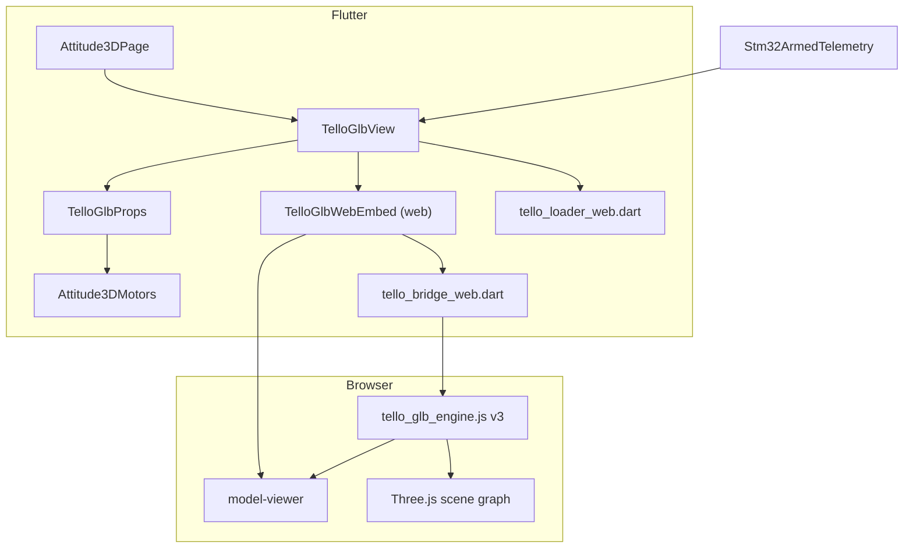

# Tello GLB 3D integration

Reference for the **DJI Tello GLB** on the **3D Attitude** tab: live FC attitude + four spinning props from motor `us=` telemetry.

Use this doc when re‑integrating, swapping GLB files, or debugging blank/static models on web.

---

## What it does

| Input | Source | Output on model |
|-------|--------|-----------------|
| `attR`, `attP`, `yaw` | STM32 via ESP serial (or DEMO) | Whole-model tilt via `<model-viewer orientation="…">` |
| `M1…M4` motor µs | Same telemetry | Per-prop spin (rad/s) on named glTF nodes |

The page also has a **WIRE** mode (pure Flutter `CustomPaint`) — independent of this GLB stack.

---

## Architecture



**Web path (primary):** Flutter embeds `<model-viewer>` in a platform view → global JS finds it inside Flutter shadow DOM → rotates prop `Object3D` nodes each frame → calls `queueRender()` (model-viewer is render-on-demand).

**Mobile path:** `model_viewer_plus` `ModelViewer` with `relatedJs:` embedding `tello_glb_engine.js` in the WebView HTML (required — injecting JS in `onWebViewCreated` runs before `loadRequest` and is wiped). Telemetry updates via `runJavaScript` after page load.

---

## File map

| Path | Role |
|------|------|
| `assets/models/dji_tello.glb` | 3D model asset |
| `web/tello_glb_engine.js` | **Core:** prop bind + spin + orientation bridge (v3) |
| `web/index.html` | Loads engine + `model-viewer.min.js` (cache-bust `?v=3`) |
| `lib/tello_glb/tello_asset.dart` | Asset path constant |
| `lib/tello_glb/tello_props.dart` | Prop node names, motor→rad/s, orientation string |
| `lib/tello_glb/tello_loader.dart` | Conditional export (web blob URL vs mobile path) |
| `lib/tello_glb/tello_loader_web.dart` | GLB bytes → `blob:` URL (avoids dev-server 404) |
| `lib/tello_glb/tello_loader_stub.dart` | Mobile: serve package asset path |
| `lib/tello_glb/tello_bridge.dart` | Conditional export (web JS vs no-op stub) |
| `lib/tello_glb/tello_bridge_web.dart` | `dart:js_interop` → `window.telloGlb*` |
| `lib/tello_glb/tello_io_engine.dart` | Inject JS into WebView on Android/iOS |
| `lib/widgets/tello_glb_view.dart` | Main widget: load model, sync telemetry, HUD |
| `lib/widgets/tello_glb_web_embed.dart` | Web: `HtmlElementView` + innerHTML `<model-viewer>` |
| `lib/widgets/tello_glb_web_embed_stub.dart` | Non-web stub |
| `lib/attitude_3d_page.dart` | GLB/WIRE toggle, wires `TelloGlbView` |
| `lib/attitude_3d_motors.dart` | Shared motor µs → spin rate math |
| `tool/inspect_glb_nodes.py` | List glTF node names (for new GLB files) |
| `test/tello_glb_props_test.dart` | Orientation + spin rate unit tests |

---

## Dependencies (`pubspec.yaml`)

```yaml
dependencies:
  model_viewer_plus: ^1.10.0   # model-viewer on mobile + ships model-viewer.min.js
  webview_flutter: ^4.12.0      # mobile WebView JS injection
  web: ^1.1.1                  # web blob URL + DOM (web embed)

flutter:
  assets:
    - assets/models/dji_tello.glb
    - web/tello_glb_engine.js   # also bundled for mobile injection
```

---

## `web/index.html` (required for web)

```html
<script src="tello_glb_engine.js?v=3"></script>
<script
  type="module"
  src="./assets/packages/model_viewer_plus/assets/model-viewer.min.js"
  defer></script>
```

**Important:** Bump `?v=N` after any change to `tello_glb_engine.js`. Hot restart does **not** reload this file; use full restart + hard refresh (Ctrl+Shift+R).

---

## GLB node layout (`dji_tello.glb`)

Inspect with:

```bash
python tool/inspect_glb_nodes.py
```

Relevant nodes:

```
GLTF_SceneRootNode
├── pervane.001_1   ← M1 prop assembly (spin this node)
├── pervane.002_3   ← M2
├── pervane.003_5   ← M3
├── pervane.004_7   ← M4
└── gövde_11        ← body (do not spin)
```

Prop parent names are defined in `TelloGlbProps.propNodeNames` and `PROP_NAMES` in the JS engine.

---

## Data flow (Dart → JS)

### 1. Telemetry → widget

`Attitude3DPage` passes `Stm32ArmedTelemetry` into `TelloGlbView`. UI ticker calls `setState` when `_demoMode` or GLB mode is active so props keep updating.

### 2. Motor µs → spin rates

`TelloGlbProps.spinRadPerSec(motorUs)` uses `Attitude3DMotors`:

- Normalize to 4 motors (`1000` µs idle)
- `spinRadPerSec(us)` — cosmetic 0…32 rad/s above `armIdleUs` (1050)
- Multiply by `spinDirections` `[1, -1, 1, -1]` (quad X CW/CCW visual)

### 3. Attitude → orientation string

model-viewer format: `"rollDeg pitchDeg yawDeg"`.

FC **pitch+ = nose down**; model-viewer **pitch+ = nose up** → negate pitch:

```dart
'${rollDeg}deg ${-pitchDeg}deg ${yawDeg}deg'
```

### 4. Push to JS (every frame / telemetry update)

```dart
telloGlbSetOrientation(ori);
telloGlbSetPropSpeeds([s0, s1, s2, s3]); // rad/s per motor
```

On web embed registration:

```dart
registerTelloGlbHost(host); // after innerHTML model-viewer is inserted
```

---

## JavaScript engine (`tello_glb_engine.js` v3)

This file is what makes props spin. These are the **critical functions** and why each exists.

### Global API (called from Dart)

| Function | Purpose |
|----------|---------|
| `telloGlbRegisterHost(hostDiv)` | Called when Flutter creates platform view; finds `<model-viewer>` inside host |
| `telloGlbSetOrientation("R P Y")` | Sets `orientation` attribute on model-viewer |
| `telloGlbSetPropSpeeds(s0,s1,s2,s3)` | Stores rad/s; ensures model is hooked |
| `telloGlbDiag()` | Debug object in browser console |

### Internal functions (the fix that made it work)

#### `findMv` / `scanShadows`

Flutter web puts `<model-viewer>` inside **shadow DOM** (`flt-platform-view`, etc.). `document.getElementById('tello_glb_mv')` from the main page **does not work**. The engine scans shadow roots every 1.5s until it finds the viewer.

#### `getModelScene(mv)`

```javascript
Object.getOwnPropertySymbols(mv).find(s => s.description === 'scene')
```

Returns model-viewer’s internal `ModelScene` object.

#### `getThreeRoots(mv)` — **do not use `mv.model` alone**

**Bug we hit:** `mv.model` on the `<model-viewer>` element is the **SceneGraph facade** (`Model` class), **not** a Three.js `Object3D`. Calling `.traverse()` on it throws:

`TypeError: model.traverse is not a function`

**Fix:** Collect real Three.js roots from internal scene:

1. `scene.threeGLTF.scene` (preferred — full glTF tree with names)
2. `scene.model` (if it is a real Object3D)
3. Symbol properties on `scene` that expose `.scene` or `.isObject3D`
4. Fallback: `mv.model` only if `.traverse` exists

#### `bindProps(mv)` — three-tier prop matching

1. **Exact names:** `pervane.001_1` … `pervane.004_7`
2. **Regex fallback:** any node matching `/pervane/i`, sorted by name
3. **Structural fallback:** first 4 children of `GLTF_SceneRootNode`

Returns true when at least one prop is bound; stores refs in `propNodes[]`.

#### `tryBind(mv, attempt)`

Retries bind up to 15× every 150ms — glTF tree may not be ready on first `load` event.

#### `tick` (requestAnimationFrame loop)

For each bound prop:

```javascript
node.rotation.y += speed * dt;
activeMv.queueRender();  // required — model-viewer does not repaint continuously
```

#### `hookMv(mv)`

- Waits for `mv.loaded` or `load` event (not `mv.model` truthiness)
- Re-binds if `propsBound === 0`

---

## Web embed (`TelloGlbWebEmbed`)

1. Register unique `platformViewRegistry` view type per widget instance
2. Create `HTMLDivElement`, set `innerHTML` to `<model-viewer id="tello_glb_mv" src="blob:…">`
3. Call `registerTelloGlbHost(host)`
4. Wrap in `HtmlElementView`

GLB URL on web comes from `resolveTelloGlbSrc()` → blob URL (dev server cannot serve `/assets/...` reliably for model-viewer).

---

## Page integration (`attitude_3d_page.dart`)

- `_AttitudeViewMode.glb` (default) → `TelloGlbView`
- `_AttitudeViewMode.wire` → `Attitude3DView`
- `_ViewModeToggle` button: **GLB / WIRE**
- Ticker: `setState` when `_demoMode || _viewMode == glb`

---

## Run & verify

```powershell
cd d:\esp\led_remote
flutter pub get
flutter run -d chrome
```

1. Open **3D Attitude** tab
2. Ensure **GLB** toggle (not WIRE)
3. Turn **DEMO ON** — model should tilt and props spin

### Browser console checks

```javascript
telloGlbDiag()
// Good:
// { engine: "v3", active: true, propsBound: 4,
//   propNames: ["pervane.001_1", ...], sceneRoots: >= 1 }

telloGlbSetPropSpeeds(30, -30, 30, -30)  // manual spin test
telloGlbSetOrientation("10deg -5deg 0deg")
```

---

## Troubleshooting

| Symptom | Cause | Fix |
|---------|-------|-----|
| `engine: "v1"` in diag | Cached old JS | Bump `?v=` in `index.html`, restart `flutter run`, Ctrl+Shift+R |
| `model.traverse is not a function` | Using SceneGraph `mv.model` facade | Use v3 engine + `getThreeRoots()` |
| `propsBound: 0`, model visible | Wrong scene root or names | Check `telloGlbDiag().sampleNames`; run `inspect_glb_nodes.py`; update `PROP_NAMES` or rely on `GLTF_SceneRootNode` fallback |
| Blank viewport | Blob URL / model load failed | Check console network; verify asset in `pubspec.yaml` |
| Props static, HUD updates | JS not loaded or not bound | `telloGlbDiag()`; confirm `tello_glb_engine.js` in Network tab |
| `url_launcher_web` error after dep change | Stale plugin registrant | `flutter clean` + full restart (not hot restart) |
| Hot restart ignores JS changes | External scripts not reloaded | Full restart + hard refresh |

---

## Swapping to another GLB

1. Add file under `assets/models/` and list in `pubspec.yaml`
2. Update `TelloGlbAsset.packagePath`
3. Run `python tool/inspect_glb_nodes.py path/to/new.glb` — find prop parent node names
4. Update `TelloGlbProps.propNodeNames` and `PROP_NAMES` in `tello_glb_engine.js`
5. If props are first N children of a known root, update the `GLTF_SceneRootNode` fallback name
6. Test spin axis: change `node.rotation.y` to `.z` or `.x` in JS if blades spin wrong
7. Bump `tello_glb_engine.js?v=N` in `index.html`

---

## Version history (engine)

| Version | Change |
|---------|--------|
| v1 | Initial — `mv.model.traverse()` (**broken** on current model-viewer) |
| v2 | `getThreeRoot()` via `scene` symbol; wait for `mv.loaded` |
| v3 | `getThreeRoots()` multi-root search; pervane regex + `GLTF_SceneRootNode` fallback; retry bind; richer `telloGlbDiag()` |

When editing the engine, always increment the guard (`telloGlbEngineV3` → `V4`) and the `index.html` cache-bust query param.

---

## Tests

```powershell
flutter test test/tello_glb_props_test.dart
```

Covers orientation pitch negation and motor→spin mapping.

---

## Related code (shared, not GLB-specific)

- `lib/attitude_3d_motors.dart` — motor µs math (also used by WIRE view)
- `lib/attitude_3d_demo_telemetry.dart` — DEMO bench data
- `lib/stm32_armed_telemetry.dart` — parses `attR attP yaw` + `us=` from serial
